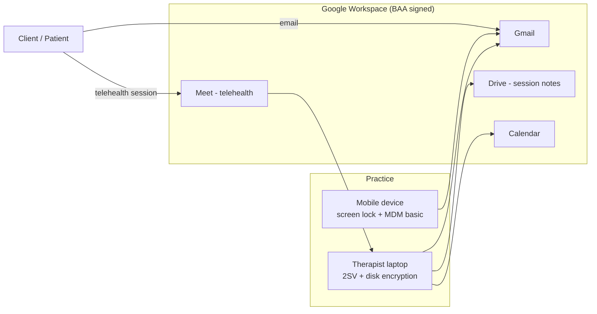

<!-- PLACEHOLDER CONTENT — replace with a reviewed architecture before launch. -->

A solo or small group practice can run its entire administrative and clinical
communication stack on Google Workspace under a single BAA. This architecture
shows the data flows and the control points HIPAA cares about.

## Data flow

## Control points

| Control | Where | Why |
| --- | --- | --- |
| Signed BAA | Admin Console → Legal & compliance | Required before any PHI touches Workspace |
| 2-Step Verification enforced | Admin Console → Security | Access control safeguard |
| Drive sharing: restricted by default | Admin Console → Apps → Drive | Prevents accidental public exposure of notes |
| Endpoint screen lock + encryption | Devices | Physical safeguard for BYOD reality |

## Known limits

This pattern covers communication and storage. It is **not** an EHR — clinical
records systems, billing clearinghouses, and payment processors each need
their own BAA and their own row in your asset inventory.
